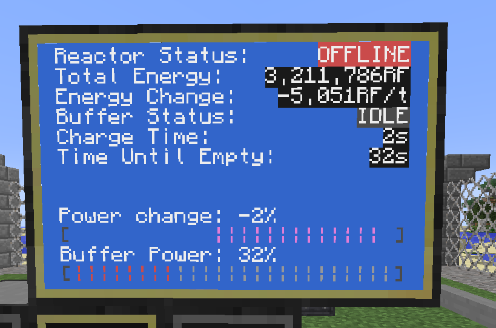

# ReactorStatus

A little script to controll BigReactors reactors via a computer port.

The UI should scale _ok_-ish for most reasonable resolutions, but it may look a bit funky. It's designed to work best with a 2x3 monitor setup, as shown above

## Configuration

There's a few lines commented at the top of the script that will likely need djusting for your particular setup.
